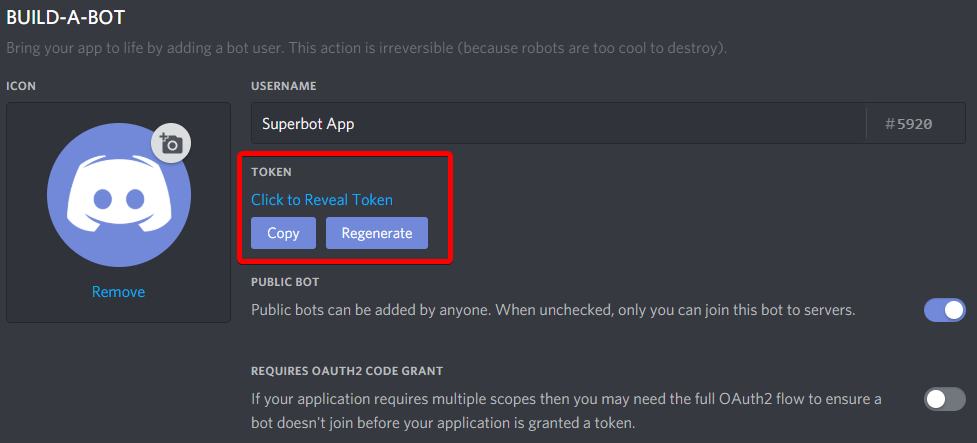

### Step 1: Creating a bot account
The first step in creating a bot is to create your own Discord application. The bot will use the Discord API, which requires the creation of an account for authentication purposes. Don't worry though, it's super simple.
#### Creating the application
To create the application, head to https://discordapp.com/developers/applications/. Log in, and you'll reach a page that looks like this:

Click on **Create an application**. This brings you to the following page, in which you should simply enter a name for the application. After clicking **Create**, you can also add an avatar. Click **Save Changes** afterwards.

#### Creating the bot account
After creating the application, we need to create the Bot User. Go to the Bot section on the left, then click on **Add Bot**, then **Yes, Do it**.

There's a few things you can change here. 
- Username: Change your bot's username on Discord
- Icon: Change the bot's avatar
- Public bot: Toggles the ability for other users to add your bot to their server.
- Require Oauth2 Code Grant: Don't check this. Just, don't.
#### Adding to your server
To generate the invite link, click on **Oauth2** in the app page, and scroll down to **Scopes**. Check the **Bot** scope to generate a link. You can also add additional permissions for the bot.

Copy the link and open it, select your server and click on **Authorize**. Cheers, it has been added to your server.
#### Getting the token
Go to the **Bot** page and copy the token. Save it somewhere, you will need that later.

### Made by Steve
